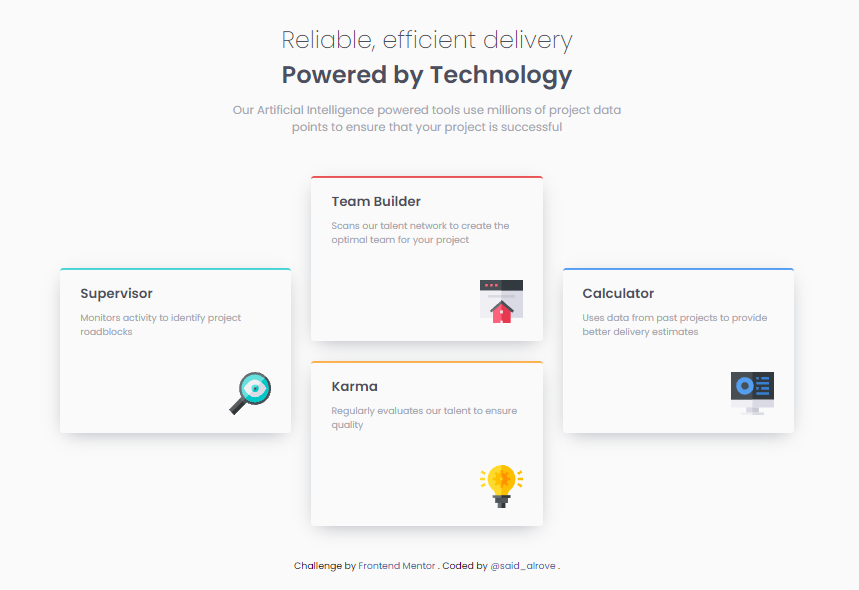

# Frontend Mentor - Four card feature solution

This is a solution to the [Four card feature](https://www.frontendmentor.io/challenges/four-card-feature-section-weK1eFYK/hub/fourcard-feature-with-a-cool-animation-sasssmacss-xYLyDShvs). Frontend Mentor challenges help you improve your coding skills by building realistic projects. 

> **Note:** in order to avoid large names, the URL of this project is an abbreviation of the name of this repository (four-card-feature-sass -> fcfs) with its unique ID (for less problems with names already taken).

## Screenshot

## Links

- [Frontend Mentor](https://www.frontendmentor.io/solutions/fourcard-feature-with-a-cool-animation-sasssmacss-xYLyDShvs)
- [Netlify](https://fcfs-1feb8d.netlify.app/)

## Author

- Frontend Mentor - [@said-alrove](https://www.frontendmentor.io/profile/said-alrove)
- Twitter - [@said_alrove](https://twitter.com/said_alrove)
